# CSC 630 Data Visualization Portfolio

## Day 1: Part to Whole

*Tools used:* `matplotlib.pyplot`

    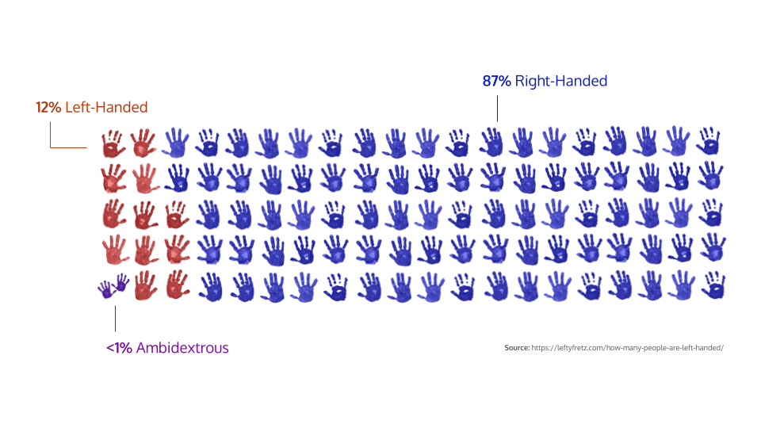

[Source](https://github.com/willwin4sure/CSC_630_Data_Visualization/blob/main/code/01_part_to_whole.py)

## Day 2: Pictogram

*Tools used:* Google Slides

    

## Day 3: Historical

*Tools used:* Folium

    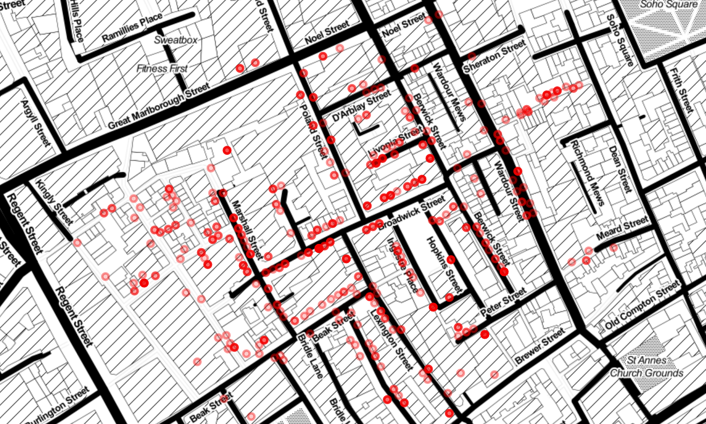

[Source](https://github.com/willwin4sure/CSC_630_Data_Visualization/blob/main/code/03_historical.py)

Based off of John Snow's historic Cholera Map:

    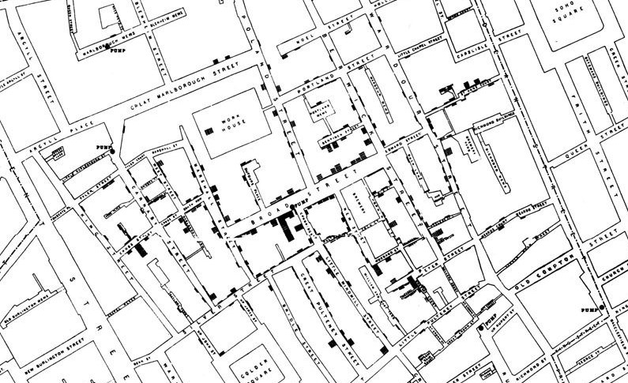

## Day 4: Magical

*Tools used:* `matplotlib.pyplot`

    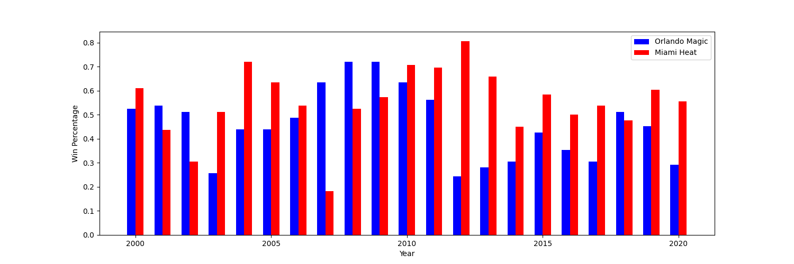

[Source](https://github.com/willwin4sure/CSC_630_Data_Visualization/blob/main/code/04_magical.py)

## Day 5: Slope

*Tools used:* `matplotlib.pyplot`

Data from predictions in https://www.weforum.org/agenda/2020/09/the-world-population-in-2100-by-country/.

    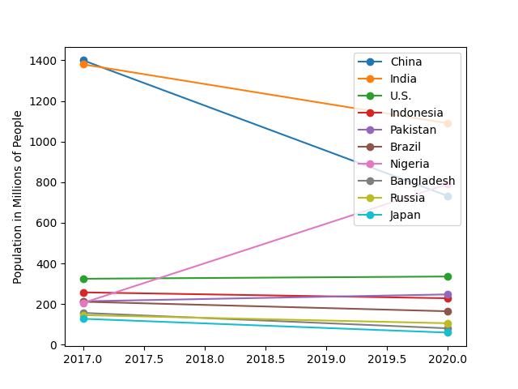

[Source](https://github.com/willwin4sure/CSC_630_Data_Visualization/blob/main/code/05_slope.py)

## Day 6: Experimental

*Tools used:* `d3.js`

Interactivity will be added when I switch to an HTML file so the JavaScript will work. Each time you click the button, new data is generated so you get a different bar chart every time. Here are some screenshots for now:

    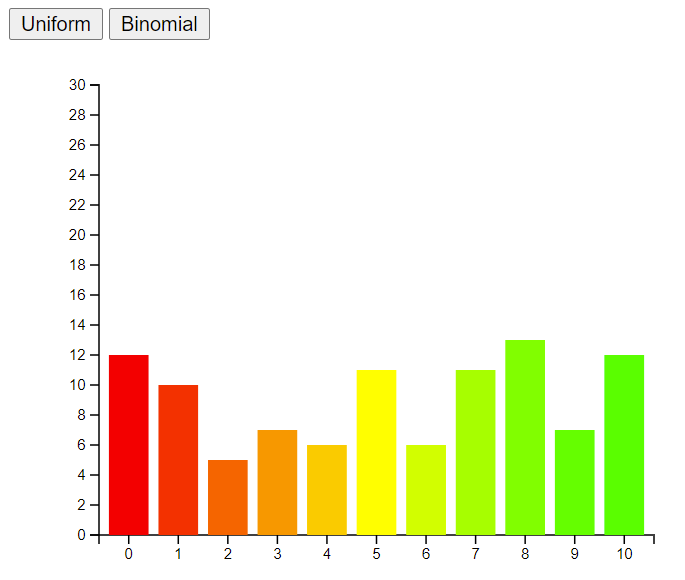

    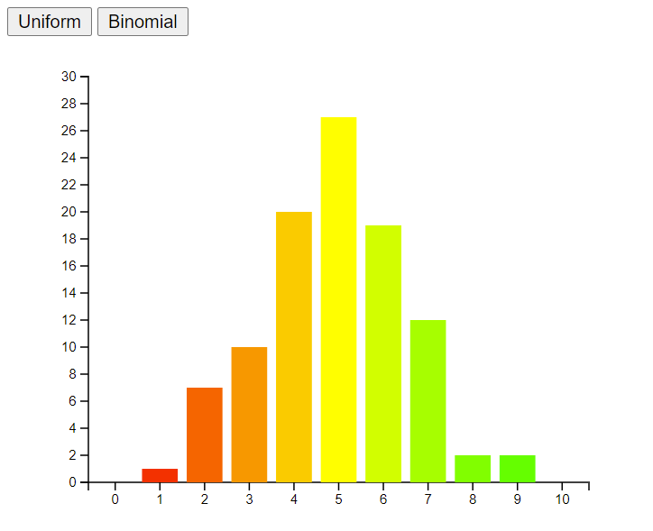

[Source](https://github.com/willwin4sure/CSC_630_Data_Visualization/blob/main/code/06_experimental.html)

## Day 7: Physical

*Tools used:* `altair`

Data from https://worldpopulationreview.com/state-rankings/flattest-states.

    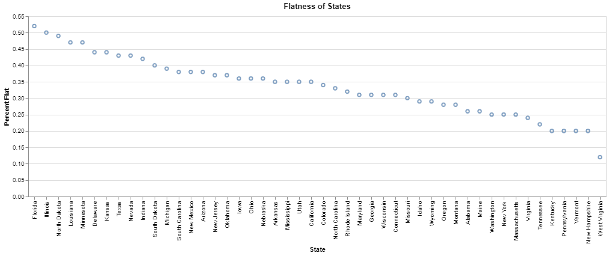

[Source](https://github.com/willwin4sure/CSC_630_Data_Visualization/blob/main/code/07_physical.ipynb)

## Day 8: Animals

*Tools used:* `altair`

Data from https://www.gaytravel.com/gay-blog/pet-ownership-statistics.

    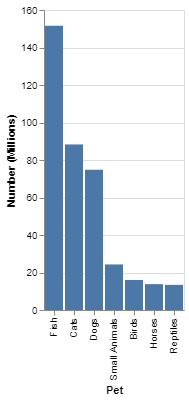

[Source](https://github.com/willwin4sure/CSC_630_Data_Visualization/blob/main/code/08_animals.ipynb)

## Day 9: Statistics

*Tools used:* Google Slides

    

## Day 10: Abstract

*Tools used:* `matplotlib.pyplot` and `numpy`

    

[Source](https://github.com/willwin4sure/CSC_630_Data_Visualization/blob/main/code/10_abstract.py)

## Day 11: Circular

*Tools used:* `altair`

Data from http://www.planecrashinfo.com/cause.htm.

    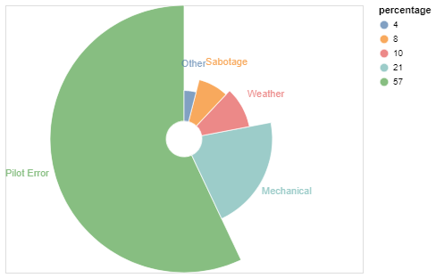

[Source](https://github.com/willwin4sure/CSC_630_Data_Visualization/blob/main/code/11_circular.ipynb)

## Day 12: Strips

*Tools used:* `altair`

Data from https://www.kaggle.com/sudalairajkumar/daily-temperature-of-major-cities.

    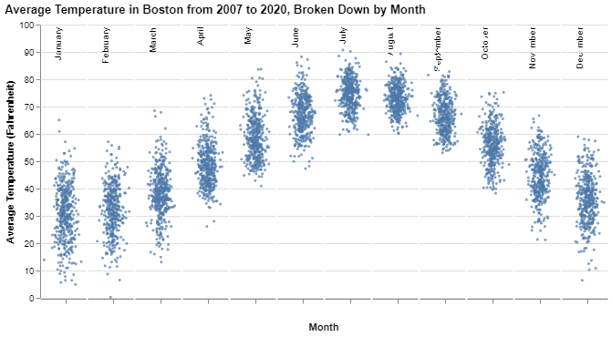

[Source](https://github.com/willwin4sure/CSC_630_Data_Visualization/blob/main/code/12_strips.ipynb)

## Day 13: Correlation

*Tools used:* `altair`

Data from https://dataverse.harvard.edu/dataset.xhtml?persistentId=doi:10.7910/DVN/T0HSJ1

    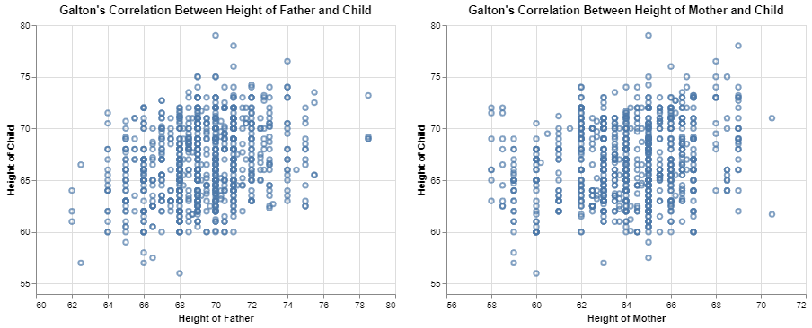

[Source](https://github.com/willwin4sure/CSC_630_Data_Visualization/blob/main/code/13_correlation.ipynb)

## Day 14: Space

*Tools used:* `altair`

Data from https://www.weforum.org/agenda/2021/02/mars-nasa-space-exploration-cost-perseverance-viking-curiosity/.

    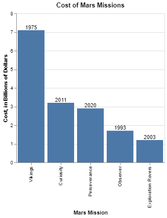

[Source](https://github.com/willwin4sure/CSC_630_Data_Visualization/blob/main/code/14_space.ipynb)

## Day 15: Multivariate

*Tools used:* `sklearn` and `seaborn`

Data from https://scikit-learn.org/stable/modules/generated/sklearn.datasets.fetch_california_housing.html

    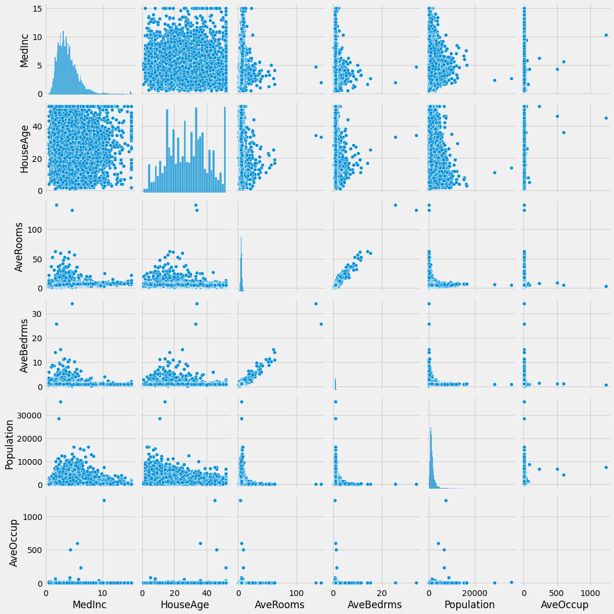

[Source](https://github.com/willwin4sure/CSC_630_Data_Visualization/blob/main/code/15_multivariate.ipynb)